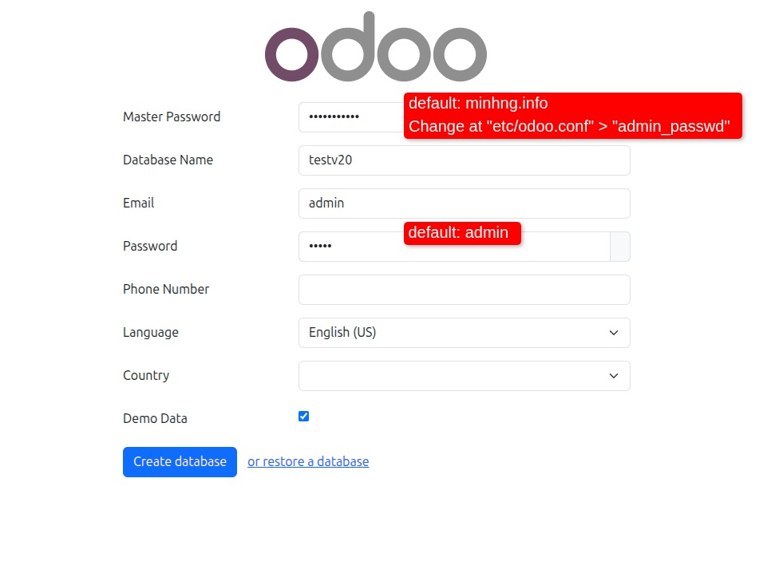
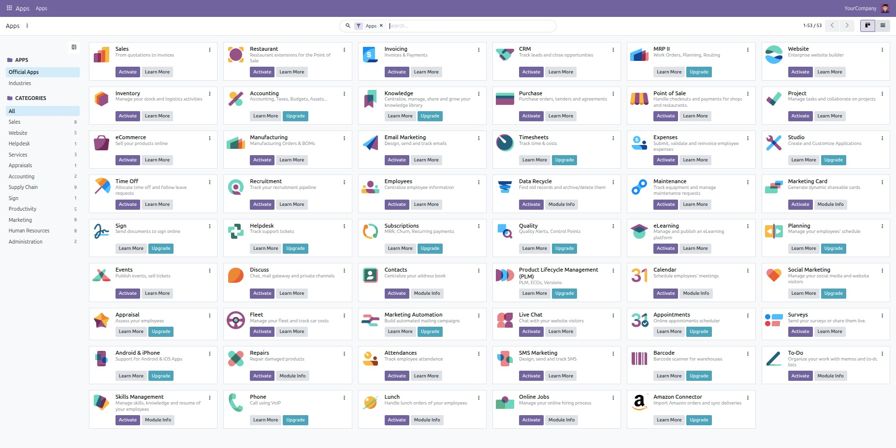
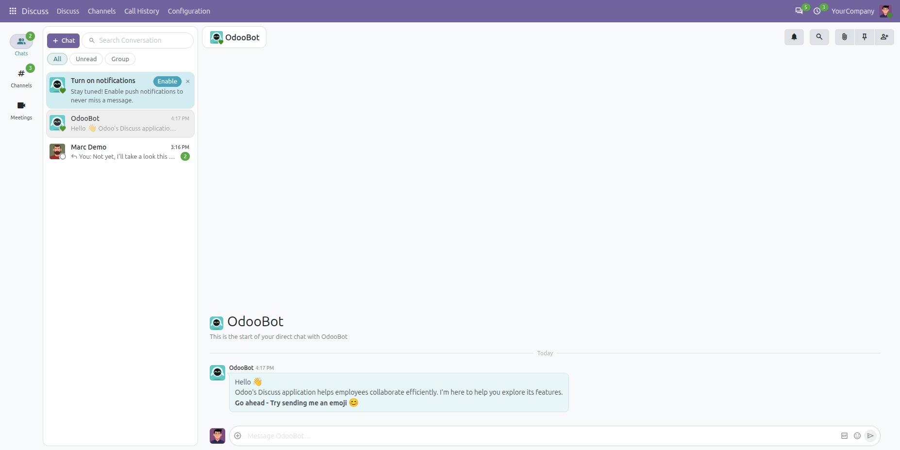
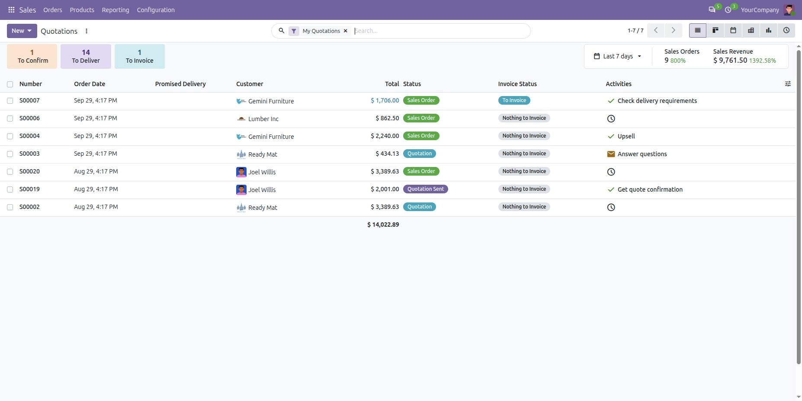
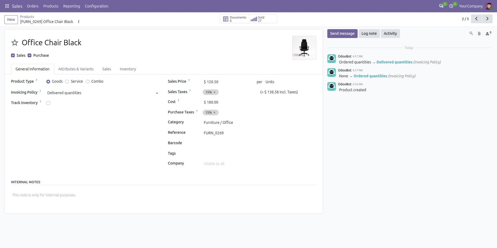

# Installing Odoo 20 (2026 release)

Set up **Odoo 20** in a single command using Docker Compose — with support for running multiple Odoo instances on one server.

> **Default master :** `minhng.info` — change it before going live.

## Quick Start

Install [Docker](https://docs.docker.com/get-docker/) and [Docker Compose](https://docs.docker.com/compose/install/) first, then run:

```bash
curl -s https://raw.githubusercontent.com/minhng92/odoo-20-docker-compose/master/run.sh \
  | bash -s odoo-one 10020 20020
```

To add a second instance on a different port:

```bash
curl -s https://raw.githubusercontent.com/minhng92/odoo-20-docker-compose/master/run.sh \
  | bash -s odoo-two 11020 21020
```

> If `curl` is missing: `sudo apt-get install curl` (Debian/Ubuntu) or `sudo yum install curl` (RHEL/CentOS).

### Arguments

| # | Example | Meaning |
|---|---------|---------|
| 1 | `odoo-one` | Name of the deploy folder where the stack is cloned |
| 2 | `10020`  | Odoo web port exposed on the host |
| 3 | `20020`  | Live-chat port exposed on the host |

## Usage

```bash
cd odoo-one
docker-compose up -d
```

Open <http://localhost:10020> to access Odoo 20.

## Tips & Troubleshooting

### Fix permission issues

If the container can't read your folders, open them up:

```bash
sudo chmod -R 777 addons etc postgresql
```

### Change the Odoo port

Edit **docker-compose.yml** in the parent directory:

```yaml
ports:
  - "11020:8069"
```

### Run in detached mode

Keep Odoo running after you close the terminal:

```bash
docker-compose up -d
```

### Set a restart policy

In **docker-compose.yml**, set the `restart` key on a service:

- `no` — don't restart
- `on-failure[:max-retries]` — restart on crash, optionally capped
- `always` — always restart
- `unless-stopped` — always restart, except when stopped by you

```yaml
restart: always   # run as a service
```

### Run multiple instances on one machine

Raise the inotify watch limit (Ubuntu) to avoid errors when several instances watch the same tree:

```bash
if grep -qF "fs.inotify.max_user_watches" /etc/sysctl.conf; then
  echo $(grep -F "fs.inotify.max_user_watches" /etc/sysctl.conf)
else
  echo "fs.inotify.max_user_watches = 524288" | sudo tee -a /etc/sysctl.conf
fi
sudo sysctl -p
```

## Custom Addons

Drop your own addons into the **addons/** folder. It's mounted into Odoo as `/mnt/extra-addons`, so they load automatically.

## Configuration & Logs

- **Configuration:** edit [`etc/odoo.conf`](etc/odoo.conf)
- **Server log:** `etc/odoo-server.log`
- **Default admin password:** `admin_passwd = minhng.info` in [`etc/odoo.conf`](etc/odoo.conf)

## Container Management

| Action  | Command                 |
|---------|-------------------------|
| Run     | `docker-compose up -d`  |
| Restart | `docker-compose restart`|
| Stop    | `docker-compose down`   |

## Live Chat

The live-chat port (default **20020**) is exposed on the host. Behind a reverse proxy (e.g. nginx), forward `/longpolling/`:

```nginx
server {
  # ...
  location /longpolling/ {
    proxy_pass http://0.0.0.0:20020/longpolling/;
  }
  # ...
}
```

## Versions

| Service     | Image           |
|-------------|-----------------|
| Odoo        | `odoo:20`       |
| PostgreSQL  | `postgres:18`   |

## Screenshots

<p align="center">

</p>

<p align="center">

</p>

<p align="center">

</p>

<p align="center">

</p>

<p align="center">

</p>

---

<details>
<summary>🤗 Support the project</summary>

If this saves you time, consider buying me a coffee.

[Buy Me a Coffee](https://buymeacoffee.com/minhng.info)

</details>
